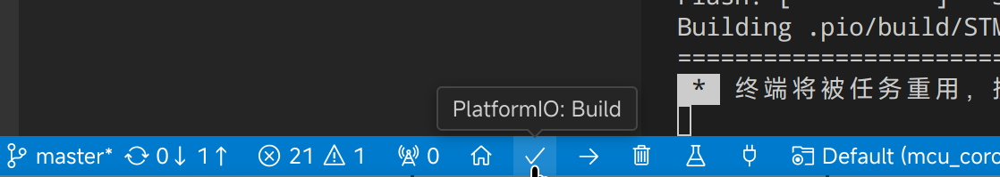
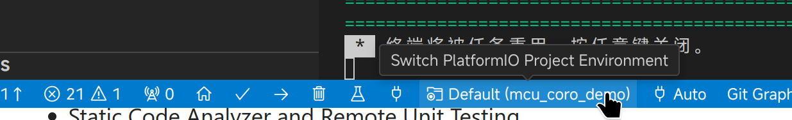

# For English README. visit [README_EN](README_EN.md)

# 在单片机环境使用 µcoro 的演示程序

本例子使用 [PlatformIO](https://platformio.org/) 进行工程管理。

推荐使用 vscode + pio 插件开发。

打开 vscode ， 安装 [platformio 插件](https://marketplace.visualstudio.com/items?itemName=platformio.platformio-ide)。

然后用 vscode 打开本项目即可。

点击 

这个按钮，即可编译。

例子使用的是 stm32g431 的 MCU.

在  src/boards/ 下新建 文件夹，以 MCU 型号，或者 开发板型号命名。
比如  src/boards/esp32

然后在 `platformio.ini` 里添加新增加的板子的代码。
就可以享受上 µcoro 无与伦比的可移植性了。

记得使用

来切换新添加的板子。

有何不懂的，可以访问 [esp32 写的 PlatformIO 教程](https://docs.espressif.com/projects/esp-idf/zh_CN/stable/esp32/third-party-tools/platformio.html)

